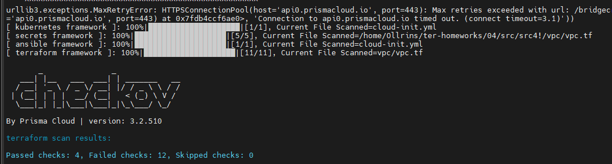
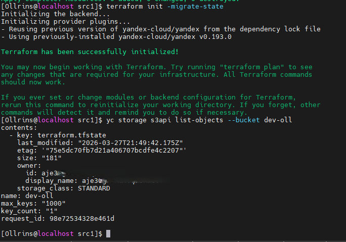
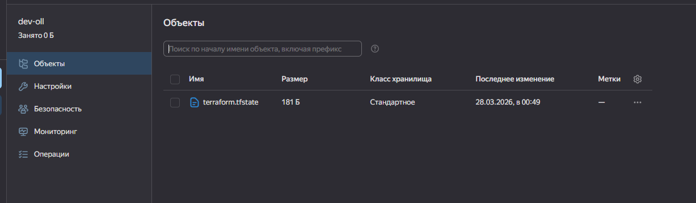
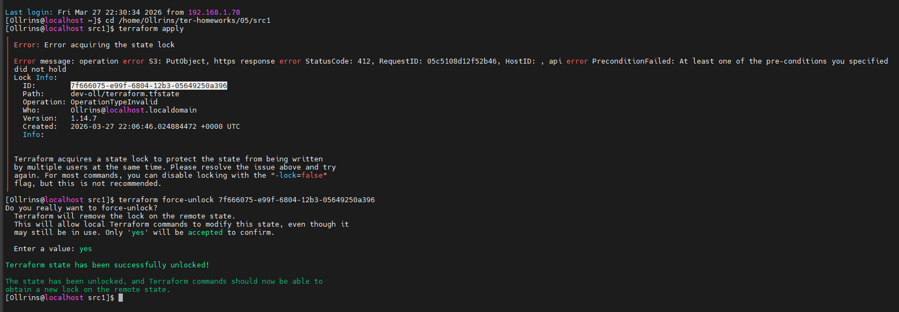
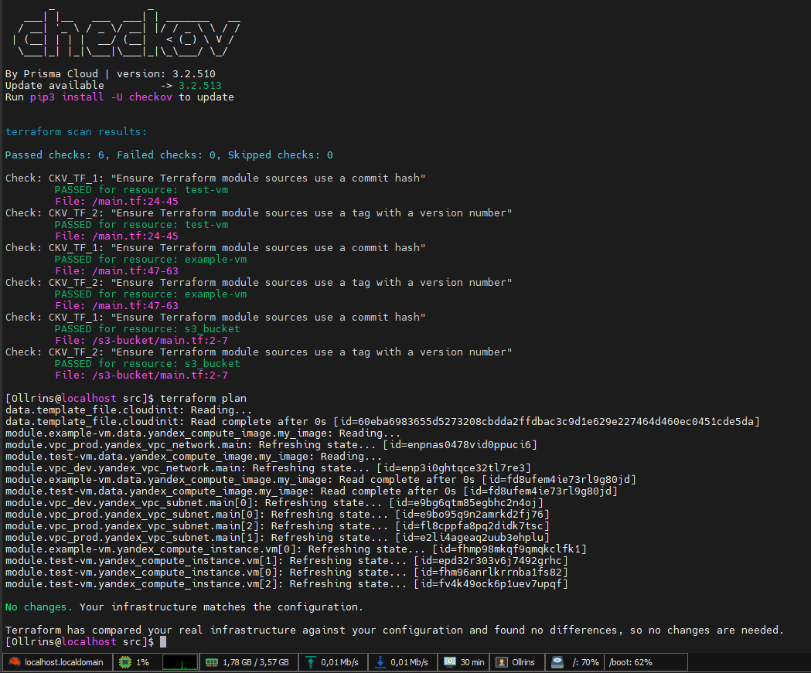
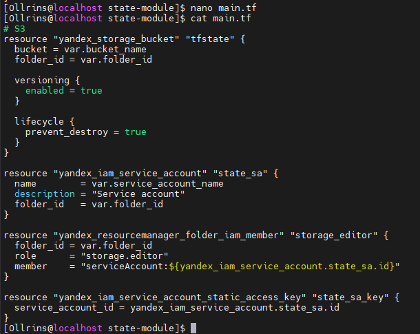
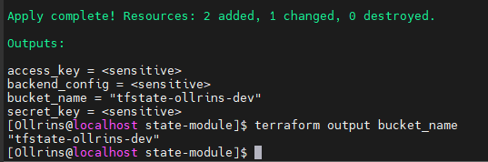

## Домашнее задание к занятию «Использование Terraform в команде»

### Задание 1

  
   
  

Ошибки CKV_TF_1 и CKV_TF_2  - строке source используется ?ref=main    
source = "git::https://github.com/udjin10/yandex_compute_instance.git?ref=main"    
CKV_TF_1: Требует использовать конкретный commit hash вместо ветки    
CKV_TF_2: Требует использовать тег с версией вместо ветки    
CKV_YC_2: "Ensure compute instance does not have public IP"    
У ВМ есть публичный IP-адрес    
CKV_YC_11: "Ensure security group is assigned to network interface"    
К сетевым интерфейсам не привязана группа безопасности    

### Задание 2

  
   
  <em>terraform init -migrate-state для миграции state в S3</em>

 

  
   
  <em>terraform.tfstate</em>

 

  
   
  <em>tfstate  lock</em>

 

### Задание 3

  
   
  <em>PR результат анализа checkov, план изменений инфраструктуры из вывода команды terraform plan</em>

 
   
  

  <a href="https://github.com/Ollrins/Terraform-meta-arguments/pull/1">ссылка на PR для ревью #1</a>

    
### Задание 4

  
   
  <em>скриншоты проверок из terraform console</em>

 

### Задание 5

  
   
  <em>переменные с валидацией</em>

 

### Задание 7

  
   
  <em>cat main.tf создание s3 backet</em>

 

  
   
  <em>вывод outputs</em>

 
