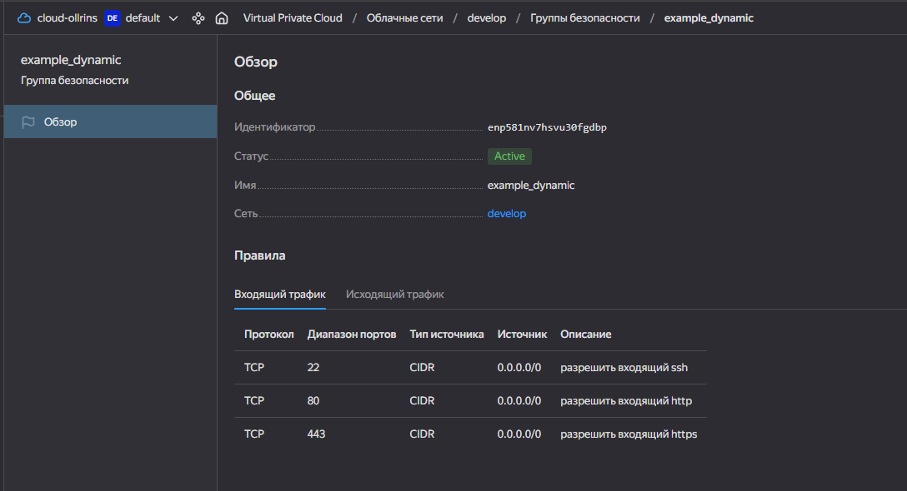
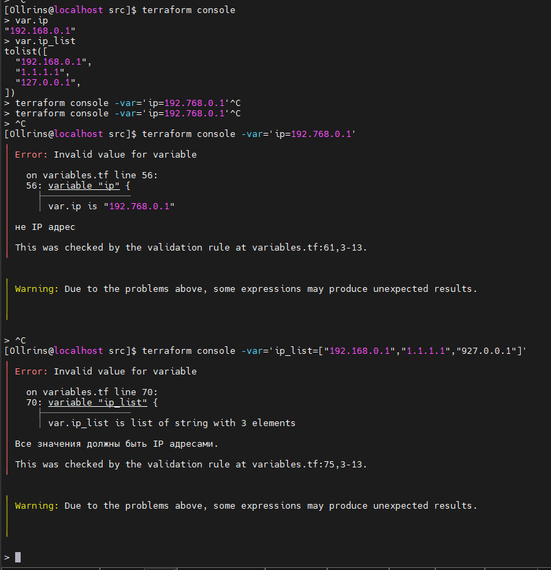
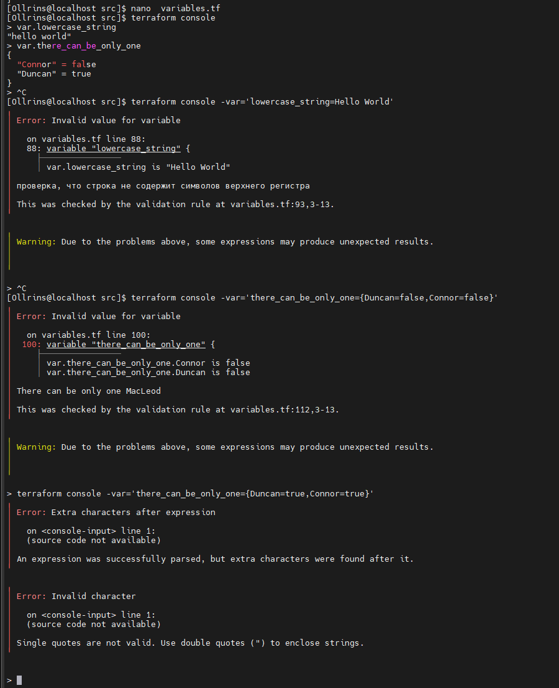

## Домашнее задание к занятию «Управляющие конструкции в коде Terraform»

### Задание 1

  
   
  <em>скриншот входящих правил «Группы безопасности» в ЛК Yandex Cloud</em>

### Задание 4

  
   
  <em>скриншот файла inventory.ini</em>

 

### Задание 5

  
   
  <em>output в виде списка словарей</em>

 
