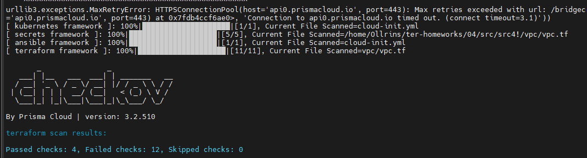
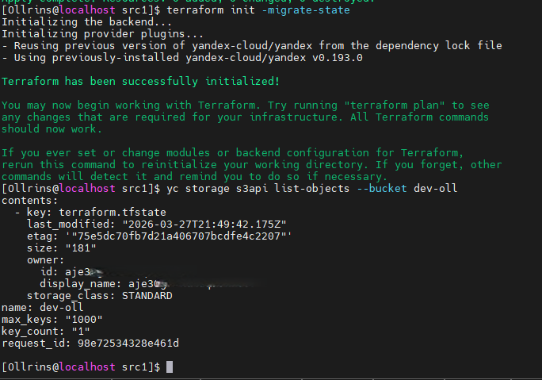
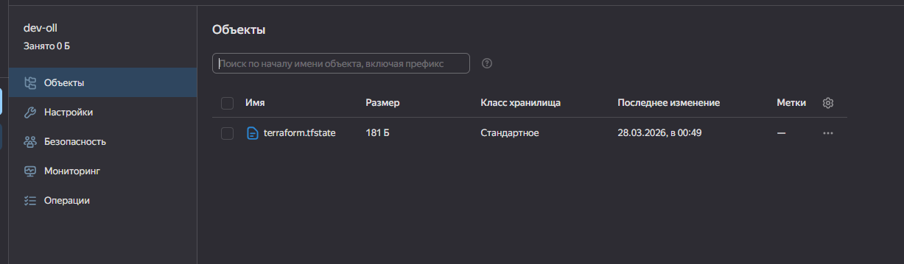
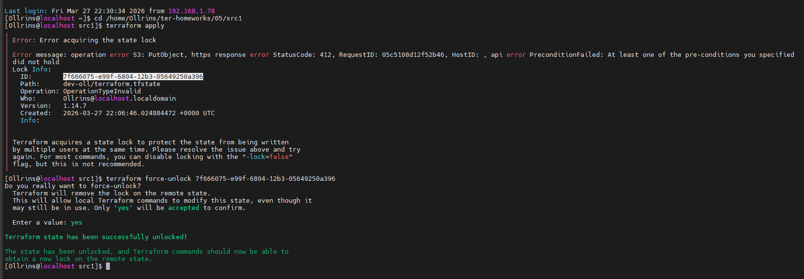
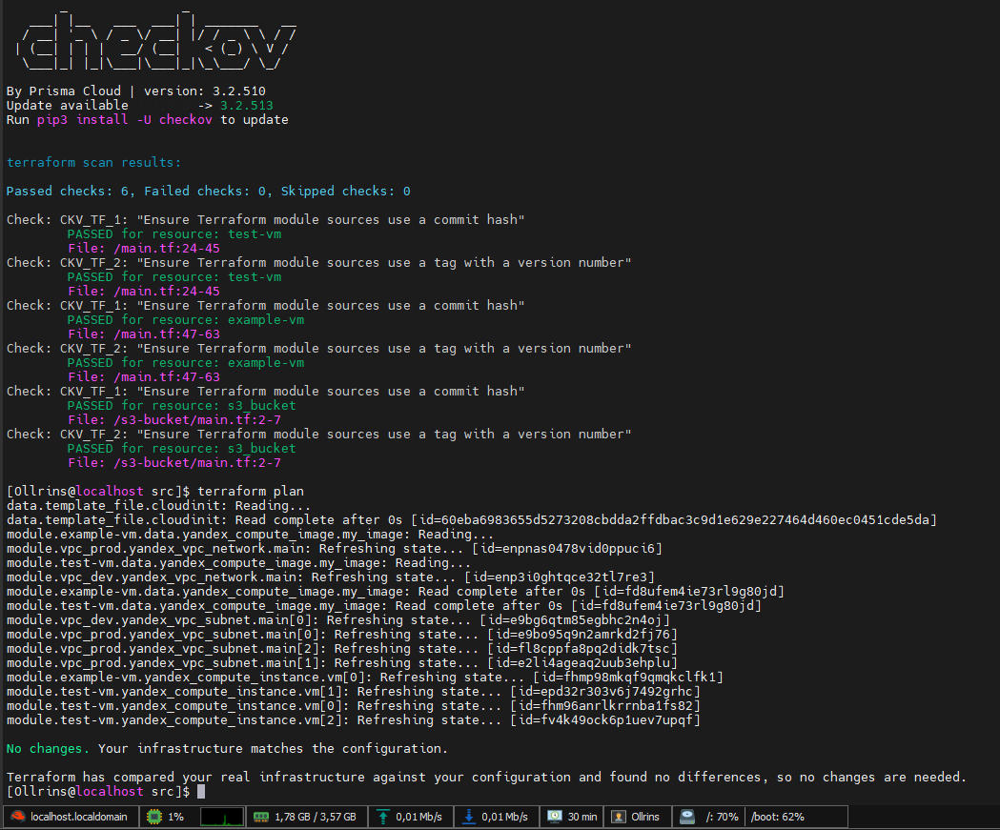
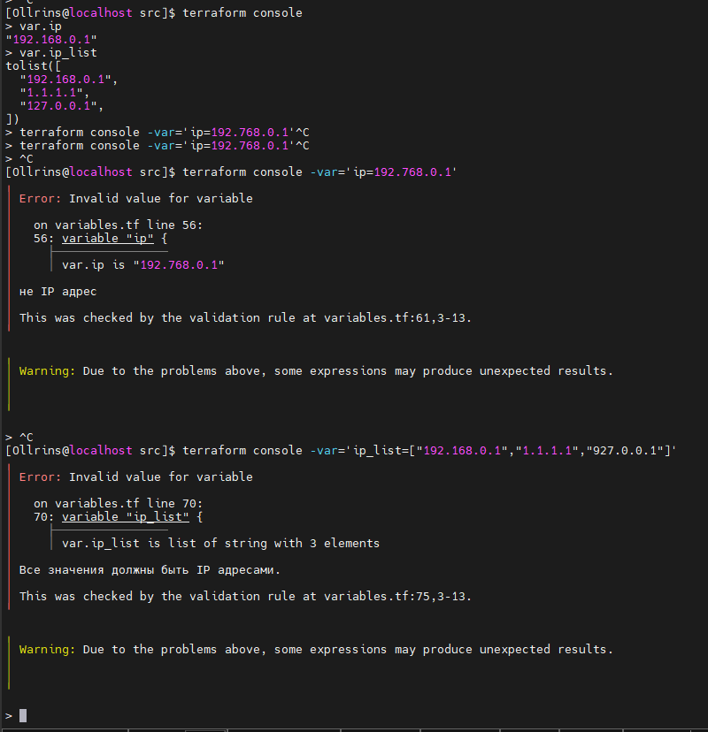
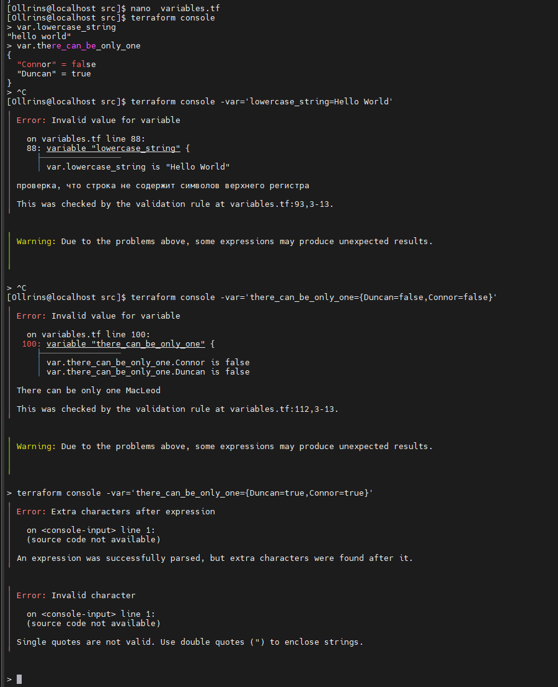
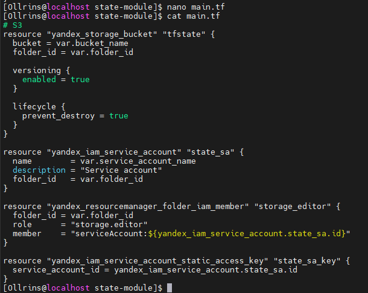
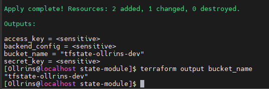

# Домашнее задание к занятию «Использование Terraform в команде»

### Цели задания

1. Научиться использовать remote state с блокировками.
2. Освоить приёмы командной работы.


### Чек-лист готовности к домашнему заданию

1. Зарегистрирован аккаунт в Yandex Cloud. Использован промокод на грант.
2. Установлен инструмент Yandex CLI.
3. Любые ВМ, использованные при выполнении задания, должны быть прерываемыми, для экономии средств.

------
### Внимание!! Обязательно предоставляем на проверку получившийся код в виде ссылки на ваш github-репозиторий!
Убедитесь что ваша версия **Terraform** ~>1.12.0
Пишем красивый код, хардкод значения не допустимы!

------
### Задание 0
1. Прочтите статью: https://neprivet.com/
2. Пожалуйста, распространите данную идею в своем коллективе.

------

### Задание 1

1. Возьмите код:
- из [ДЗ к лекции 4](https://github.com/netology-code/ter-homeworks/tree/main/04/src),
- из [демо к лекции 4](https://github.com/netology-code/ter-homeworks/tree/main/04/demonstration1).
2. Проверьте код с помощью tflint и checkov. Вам не нужно инициализировать этот проект.
3. Перечислите, какие **типы** ошибок обнаружены в проекте (без дублей).

------

### Задание 2

1. Возьмите ваш GitHub-репозиторий с **выполненным ДЗ 4** в ветке 'terraform-04' и сделайте из него ветку 'terraform-05'.
2. Настройте remote state с встроенными блокировками:
   - Создайте S3 bucket в Yandex Cloud для хранения state (если еще не создан)
   - Создайте service account с правами на чтение/запись в bucket
   - Настройте backend в providers.tf с использованием нового механизма блокировок:
     ```hcl
     terraform {
       required_version = "~>1.12.0"
       
       backend "s3" {
         bucket  = "ваш-bucket-name"
         key     = "terraform.tfstate"
         region  = "ru-central1"
         
         # Встроенный механизм блокировок (Terraform >= 1.6)
         # Не требует отдельной базы данных!
         use_lockfile = true
         
         endpoints = {
           s3 = "https://storage.yandexcloud.net"
         }
         
         skip_region_validation      = true
         skip_credentials_validation = true
         skip_requesting_account_id  = true
         skip_s3_checksum            = true
       }
     }
     ```
   - Выполните `terraform init -migrate-state` для миграции state в S3
   - Предоставьте скриншоты процесса настройки и миграции
3. Закоммитьте в ветку 'terraform-05' все изменения.
4. Откройте в проекте terraform console, а в другом окне из этой же директории попробуйте запустить terraform apply.
5. Пришлите ответ об ошибке доступа к state (блокировка должна сработать автоматически).
6. Принудительно разблокируйте state командой `terraform force-unlock <LOCK_ID>`. Пришлите команду и вывод.

**Примечание:** В Terraform >= 1.6 появился встроенный механизм блокировок через `use_lockfile = true`. 
Это упрощает настройку - больше не нужно создавать отдельную базу данных (YDB в режиме DynamoDB) для хранения блокировок.
Lock-файл создается автоматически в том же S3 bucket рядом с state-файлом с именем `<key>.lock.info`.


------
### Задание 3  

1. Сделайте в GitHub из ветки 'terraform-05' новую ветку 'terraform-hotfix'.
2. Проверье код с помощью tflint и checkov, исправьте все предупреждения и ошибки в 'terraform-hotfix', сделайте коммит.
3. Откройте новый pull request 'terraform-hotfix' --> 'terraform-05'. 
4. Вставьте в комментарий PR результат анализа tflint и checkov, план изменений инфраструктуры из вывода команды terraform plan.
5. Пришлите ссылку на PR для ревью. Вливать код в 'terraform-05' не нужно.

------
### Задание 4

1. Напишите переменные с валидацией и протестируйте их, заполнив default верными и неверными значениями. Предоставьте скриншоты проверок из terraform console. 

- type=string, description="ip-адрес" — проверка, что значение переменной содержит верный IP-адрес с помощью функций cidrhost() или regex(). Тесты:  "192.168.0.1" и "1920.1680.0.1";
- type=list(string), description="список ip-адресов" — проверка, что все адреса верны. Тесты:  ["192.168.0.1", "1.1.1.1", "127.0.0.1"] и ["192.168.0.1", "1.1.1.1", "1270.0.0.1"].

## Дополнительные задания (со звёздочкой*)

**Настоятельно рекомендуем выполнять все задания со звёздочкой.** Их выполнение поможет глубже разобраться в материале.   
Задания со звёздочкой дополнительные, не обязательные к выполнению и никак не повлияют на получение вами зачёта по этому домашнему заданию. 
------
### Задание 5*
1. Напишите переменные с валидацией:
- type=string, description="любая строка" — проверка, что строка не содержит символов верхнего регистра;
- type=object — проверка, что одно из значений равно true, а второе false, т. е. не допускается false false и true true:
```
variable "in_the_end_there_can_be_only_one" {
    description="Who is better Connor or Duncan?"
    type = object({
        Dunkan = optional(bool)
        Connor = optional(bool)
    })

    default = {
        Dunkan = true
        Connor = false
    }

    validation {
        error_message = "There can be only one MacLeod"
        condition = <проверка>
    }
}
```
------
### Задание 6*

1. Настройте любую известную вам CI/CD-систему. Если вы ещё не знакомы с CI/CD-системами, настоятельно рекомендуем вернуться к этому заданию после изучения Jenkins/Teamcity/Gitlab.
2. Скачайте с её помощью ваш репозиторий с кодом и инициализируйте инфраструктуру.
3. Уничтожьте инфраструктуру тем же способом.


------
### Задание 7*
1. Настройте отдельный terraform root модуль, который будет создавать инфраструктуру для remote state:
   - S3 bucket для tfstate с версионированием
   - Сервисный аккаунт с необходимыми правами (storage.editor)
   - Static access key для сервисного аккаунта
2. Output должен содержать:
   - Имя bucket
   - Access key ID и Secret key (sensitive)
   - Пример конфигурации backend для использования
3. После создания инфраструктуры используйте outputs для настройки backend в основном проекте.

**Примечание:** Так как используется `use_lockfile = true`, создавать YDB/DynamoDB больше не требуется.
Блокировки реализованы встроенным механизмом Terraform и хранятся в том же S3 bucket. 

--

## Домашнее задание к занятию «Использование Terraform в команде»

### Задание 1
<p align="center">
  
  <br>
  </p>
<p>
Ошибки CKV_TF_1 и CKV_TF_2  - строке source используется ?ref=main   <br>
source = "git::https://github.com/udjin10/yandex_compute_instance.git?ref=main"   <br>
CKV_TF_1: Требует использовать конкретный commit hash вместо ветки   <br>
CKV_TF_2: Требует использовать тег с версией вместо ветки   <br>
CKV_YC_2: "Ensure compute instance does not have public IP"   <br>
У ВМ есть публичный IP-адрес   <br>
CKV_YC_11: "Ensure security group is assigned to network interface"   <br>
К сетевым интерфейсам не привязана группа безопасности   <br>
</p>

### Задание 2
<p align="center">
  
  <br>
  <em>terraform init -migrate-state для миграции state в S3</em>
</p> 

<p align="center">
  
  <br>
  <em>terraform.tfstate</em>
</p> 

<p align="center">
  
  <br>
  <em>tfstate  lock</em>
</p> 

### Задание 3
<p align="center">
  
  <br>
  <em>PR результат анализа checkov, план изменений инфраструктуры из вывода команды terraform plan</em>
</p> 
  <br>
  <p align="center">
  <a href="https://github.com/Ollrins/Terraform-meta-arguments/pull/1">ссылка на PR для ревью #1</a>
</p>
    
### Задание 4
<p align="center">
  
  <br>
  <em>скриншоты проверок из terraform console</em>
</p> 

### Задание 5
<p align="center">
  
  <br>
  <em>переменные с валидацией</em>
</p> 

### Задание 7
<p align="center">
  
  <br>
  <em>cat main.tf создание s3 backet</em>
</p> 
<p align="center">
  
  <br>
  <em>вывод outputs</em>
</p> 


1. Создание bucket в Yandex Object Storage
```bash
# Установите имя bucket (должно быть уникальным во всем Yandex Cloud)
BUCKET_NAME="tf-state-your-unique-name-$(date +%Y%m%d)"

# Создайте bucket
yc storage bucket create \
  --name $BUCKET_NAME \
  --folder-id YOUR_FOLDER_ID \
  --default-storage-class standard

# Проверьте создание bucket
yc storage bucket list --folder-id YOUR_FOLDER_ID

# Настройте ACL для bucket (опционально - приватный доступ)
yc storage bucket update \
  --name $BUCKET_NAME \
  --acl private
```

2. Создание сервисного аккаунта для доступа к S3
```bash
# Создайте сервисный аккаунт
SA_NAME="tf-state-sa"
yc iam service-account create --name $SA_NAME --folder-id YOUR_FOLDER_ID

# Получите ID сервисного аккаунта
SA_ID=$(yc iam service-account get $SA_NAME --format json | jq -r '.id')
echo "Service Account ID: $SA_ID"
```

3. Назначение прав на bucket
```bash
# Назначьте права на bucket (read + write)
yc storage bucket update \
  --name $BUCKET_NAME \
  --grant-read write,read \
  --subject-id $SA_ID

# Альтернативный вариант: назначить права через ACL
# yc storage bucket update --name $BUCKET_NAME --acl grant-write --grantee-id $SA_ID
```
4. Создание ключей доступа для сервисного аккаунта
```bash
# Создайте ключ доступа для сервисного аккаунта
yc iam access-key create \
  --service-account-name $SA_NAME \
  --format json > sa_keys.json

# Извлеките ключи
ACCESS_KEY=$(jq -r '.access_key.key_id' sa_keys.json)
SECRET_KEY=$(jq -r '.secret' sa_keys.json)

echo "Access Key: $ACCESS_KEY"
echo "Secret Key: $SECRET_KEY"

# Сохраните ключи в безопасное место (опционально)
# echo "AWS_ACCESS_KEY_ID=$ACCESS_KEY" > .env
# echo "AWS_SECRET_ACCESS_KEY=$SECRET_KEY" >> .env
```
5. Настройка переменных окружения для доступа к S3
```bash
# Установите переменные окружения для доступа к S3
export AWS_ACCESS_KEY_ID=$ACCESS_KEY
export AWS_SECRET_ACCESS_KEY=$SECRET_KEY
export AWS_DEFAULT_REGION="ru-central1"

# Проверьте, что переменные установлены
echo "AWS_ACCESS_KEY_ID: $AWS_ACCESS_KEY_ID"
echo "AWS_DEFAULT_REGION: $AWS_DEFAULT_REGION"
```
6. Создание конфигурации backend.tf
Перейдите в директорию с вашим Terraform проектом:

```bash
cd /path/to/your/terraform/project
```
Создайте файл backend.tf:

```bash
cat > backend.tf << EOF
terraform {
  required_version = "~> 1.12.0"
  
  backend "s3" {
    bucket  = "$BUCKET_NAME"
    key     = "terraform.tfstate"
    region  = "ru-central1"
    
    # Встроенный механизм блокировок (Terraform >= 1.6)
    # Не требует отдельной базы данных!
    use_lockfile = true
    
    endpoints = {
      s3 = "https://storage.yandexcloud.net"
    }
    
    skip_region_validation      = true
    skip_credentials_validation = true
    skip_requesting_account_id  = true
    skip_s3_checksum            = true
  }
}
EOF

# Просмотрите созданный файл
cat backend.tf
```
7. Инициализация Terraform с миграцией state
```bash
# Инициализируйте Terraform с миграцией существующего state
terraform init -migrate-state

# При запросе подтвердите миграцию, введя "yes"
```
8. Проверка загрузки state в S3
```bash
# Проверьте, что state загружен в S3
yc storage object list \
  --bucket-name $BUCKET_NAME \
  --folder-id YOUR_FOLDER_ID

# Скачайте и проверьте содержимое state
yc storage object get \
  --bucket-name $BUCKET_NAME \
  --name terraform.tfstate \
  --output terraform.tfstate.downloaded

# Проверьте содержимое скачанного state файла
cat terraform.tfstate.downloaded | jq '.'

# Удалите временный файл (опционально)
rm terraform.tfstate.downloaded
```
9. Очистка (при необходимости)
```bash
# Удалить объект state из bucket
yc storage object delete \
  --bucket-name $BUCKET_NAME \
  --name terraform.tfstate

# Удалить bucket (только если он пуст)
yc storage bucket delete --name $BUCKET_NAME

# Удалить сервисный аккаунт
yc iam service-account delete --name $SA_NAME

# Удалить файл с ключами
rm sa_keys.json .env
```
